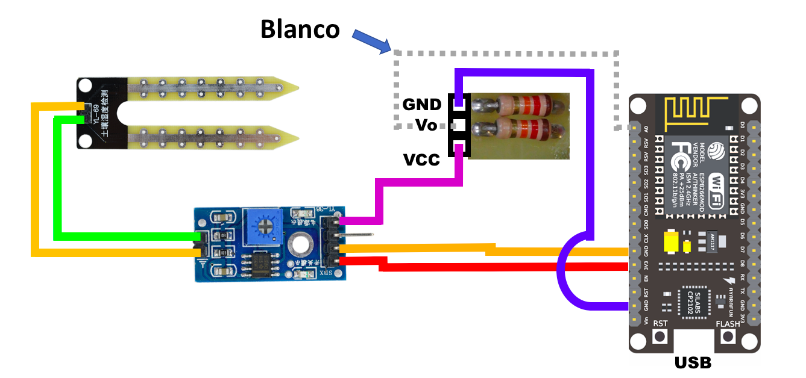
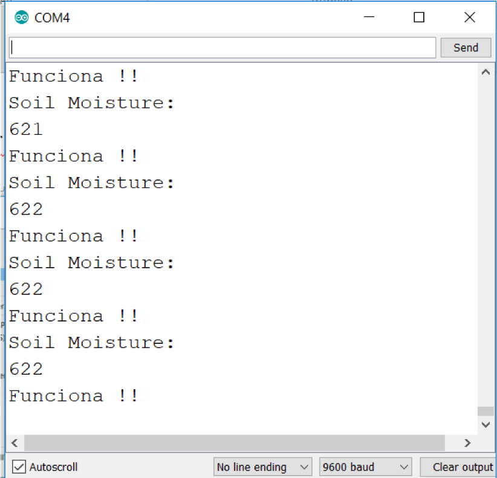

# IoT Platform en monitoreo de plantas

Este tutorial muestra como poder unir un dispositivo de IoT como Node MCU, Arduino, Raspberry Pi, etc. con los servicios en IBM Cloud. El tutorial tiene como objetivo de realizar un sistema de monitoreo de plantas, con sensores de humedad y de luminicidad, que permita visualizar el estado actual y configurar reglas y alertas tempranas.

Después de terminar este tutorial usted entenderá como: 

* Configurar y conectar un dispositivo
* Crear tableros de control
* Crear interfaces fisicas y logicas
* Integrar el flujo de datos con una aplicación en Node-RED
* Crear reglas

El servicio de Internet of Things Platform permite 


## Componentes Incluidos

* [Internet of Things Platform](https://console.bluemix.net/catalog/services/internet-of-things-platform): Permite comunicarse y consumir datos de dispositivos conectados y gateways.
* [Node-RED](https://nodered.org/): Es un framework Open Source que permite construir aplicaciones basdas en flujos y eventos.
* [Cloudant](https://console.ng.bluemix.net/catalog/services/cloudant-nosql-db): Una base de datos completamente manejada diseñada para aplicaciones web y mobile modernas que usan documentos como JSON.
* [Arduino IDE](https://www.arduino.cc/en/Main/Software): Software Open Source que facilita escribir código y cargarlo en la board


## Materiales

* Tarjeta Node MCU with ESP8266
* Sensor de humedad (HL-69) + transductor
* Sensor de luminicidad (BH1750)
* Cables para conexiones
* 2 Resistencias 12K Ohms

# Paso a Paso

### 1. Clonar el repo

Clona el repositorio `iot-plantas` localmente. En una terminal, ejecuta:

```
$ git clone https://github.com/libardolara/iot-plantas
```

### 2. Configuración del Arduino IDE

Se debe configurar el Arduino IDE para trabajar con la tarjeta Node MCU ESP8266 y con el sensor de luz. Para esto debes tener instalado [Arduino IDE](https://www.arduino.cc/en/Main/Software).

#### Configurar Administrador de la Tarjeta

* Abre **Arduino IDE**
* Ve al menú _Archivo -> Preferencias_ y en el campo para adicionar una URL para administrar tarjetas agrega la url para la tarjeta ESP8266 http://arduino.esp8266.com/stable/package_esp8266com_index.json
* En el menú _Herramientas -> Board... -> Administrador de Tarjetas..._
* En el buscador de la ventana emergente escribe **esp**
* Selecciona el administrador para la tarjeta ESP8266, antes de hacer click en instalar asegurate que la version sea la ultima.
* Espera mientras instala el administrador de la tarjeta.
* En el menú _Herramientas -> Board..._ selecciona la tarjeta NodeMCU (ESP-12E Module)

#### Agregar librerias

* Ve al menú _Sketch -> Include Library -> Add .ZIP Library..._.
* Selecciona el archivo [](pubsubclient-2.3.zip) para instalar la libreria de mensajeria MQTT.
* Ve al menú _Sketch -> Include Library -> Add .ZIP Library..._.
* Selecciona el archivo [](BH1750-master.zip) para instalar la libreria del sensor de luz.

### 3. Conectar y probar el sensor de humedad

Conecta la tarjeta ESP8266 con el sensor de humedad, el transductor y las resistencias. Sigue el diagrama:



* Conecta la tarjeta a tu puerto USB
* Abre el archivo [](codes/humidity_sensor.ccp), copia el contenido y pegalo en el editor del Arduino IDE
* Ve al menú _Herramientas -> Port... ->_ y selecciona un puerto USB (COM*)

> Si utilizas MacOS instala primero el driver para usar el puerto USB de https://www.silabs.com/products/development-tools/software/usb-to-uart-bridge-vcp-drivers

* Haz click en el boto de ejecutar el código.
* Espera la compilación del programa, si falla vuelve a intentarlo cambiando de puerto en el IDE.
* Cuando la compilación termine exitosamente al 100% ve al menú _Herramientas -> Monitor Serial_ para revisar las lecturas del sensor de humedad



### 4. Conectar y probar el sensor de luz


### 5. Crear el servicio IoT Platform


### 6. Registro del dispositivo


### 7. Crear tableros


### 8. Crear interfaces


