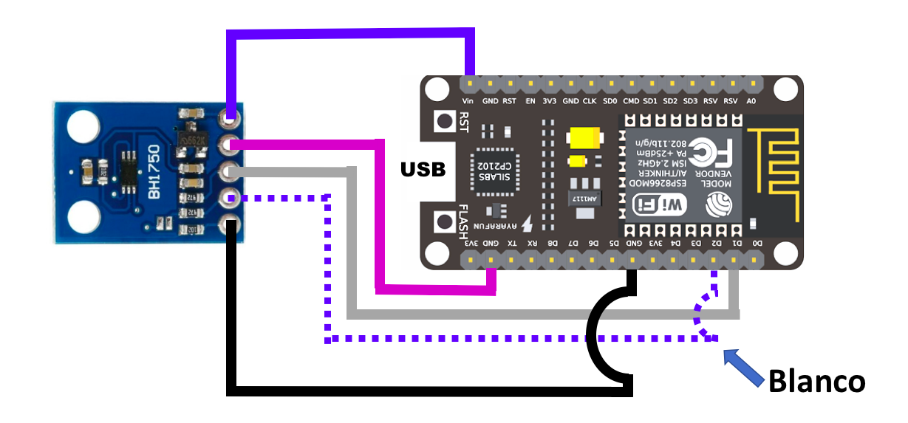

# IoT Platform en monitoreo de plantas

> Presentación [IoT Platform en monitoreo de plantas](https://ibm.box.com/v/iot-plantas)

Este tutorial muestra como poder unir un dispositivo de IoT como Node MCU, Arduino, Raspberry Pi, etc. con los servicios en IBM Cloud. El tutorial tiene como objetivo de realizar un sistema de monitoreo de plantas, con sensores de humedad y de luminicidad, que permita visualizar el estado actual y configurar reglas y alertas tempranas.

Después de terminar este tutorial usted entenderá como: 

* Configurar y conectar un dispositivo
* Crear tableros de control
* Crear interfaces fisicas y logicas
* Integrar el flujo de datos con una aplicación en Node-RED
* Crear reglas

El servicio de Internet of Things Platform permite 


## Componentes Incluidos

* [Internet of Things Platform](https://console.bluemix.net/catalog/services/internet-of-things-platform): Permite comunicarse y consumir datos de dispositivos conectados y gateways.
* [Node-RED](https://nodered.org/): Es un framework Open Source que permite construir aplicaciones basdas en flujos y eventos.
* [Cloudant](https://console.ng.bluemix.net/catalog/services/cloudant-nosql-db): Una base de datos completamente manejada diseñada para aplicaciones web y mobile modernas que usan documentos como JSON.
* [Arduino IDE](https://www.arduino.cc/en/Main/Software): Software Open Source que facilita escribir código y cargarlo en la board


## Materiales

* Tarjeta Node MCU with ESP8266
* Sensor de humedad (HL-69) + transductor
* Sensor de luminicidad (BH1750)
* Cables para conexiones
* 2 Resistencias 12K Ohms

# Paso a Paso

### 1. Clonar el repo

Clona el repositorio `iot-plantas` localmente. En una terminal, ejecuta:

```
$ git clone https://github.com/libardolara/iot-plantas
```

### 2. Configuración del Arduino IDE

Se debe configurar el Arduino IDE para trabajar con la tarjeta Node MCU ESP8266 y con el sensor de luz. Para esto debes tener instalado [Arduino IDE](https://www.arduino.cc/en/Main/Software).

#### Configurar Administrador de la Tarjeta

* Abre **Arduino IDE**
* Ve al menú _Archivo -> Preferencias_ y en el campo para adicionar una URL para administrar tarjetas agrega la url para la tarjeta ESP8266 http://arduino.esp8266.com/stable/package_esp8266com_index.json
* En el menú _Herramientas -> Board... -> Administrador de Tarjetas..._
* En el buscador de la ventana emergente escribe **esp**
* Selecciona el administrador para la tarjeta ESP8266, antes de hacer click en instalar asegurate que la version sea la ultima.
* Espera mientras instala el administrador de la tarjeta.
* En el menú _Herramientas -> Board..._ selecciona la tarjeta NodeMCU (ESP-12E Module)

#### Agregar librerias

* Ve al menú _Sketch -> Include Library -> Add .ZIP Library..._.
* Selecciona el archivo [lib/pubsubclient-2.3.zip](lib/pubsubclient-2.3.zip) para instalar la libreria de mensajeria MQTT.
* Ve al menú _Sketch -> Include Library -> Add .ZIP Library..._.
* Selecciona el archivo [lib/BH1750-master.zip](lib/BH1750-master.zip) para instalar la libreria del sensor de luz.

### 3. Conectar y probar el sensor de humedad

Conecta la tarjeta ESP8266 con el sensor de humedad, el transductor y las resistencias. Sigue el diagrama:


* Conecta la tarjeta a tu puerto USB
* Abre el archivo [Snippets/humidity_sensor.cpp](Snippets/humidity_sensor.cpp), copia el contenido y pegalo en el editor del Arduino IDE
* Ve al menú _Herramientas -> Port... ->_ y selecciona un puerto USB (COM*)

> Si utilizas MacOS instala primero el driver para usar el puerto USB de https://www.silabs.com/products/development-tools/software/usb-to-uart-bridge-vcp-drivers

* Haz click en el boto de ejecutar el código.
* Espera la compilación del programa, si falla vuelve a intentarlo cambiando de puerto en el IDE.
* Cuando la compilación termine exitosamente al 100% ve al menú _Herramientas -> Monitor Serial_ para revisar las lecturas del sensor de humedad

Ejemplo:
```
Funciona !!
Soil Moisture:
123
```

### 4. Conectar y probar el sensor de luz

Conecta el dispositivo creado en el punto anterior con el sensor de luz. (Antes desconecta el puerto USB) 
Sigue el diagrama:



* Conecta la tarjeta a tu puerto USB
* Abre el archivo [Snippets/light_sensor.cpp](Snippets/light_sensor.cpp), copia el contenido y pegalo reemplazando el código del editod el Arduino IDE
* Haz click en el boto de ejecutar el código.
* Espera la compilación del programa.
* Cuando la compilación termine exitosamente al 100% ve al menú _Herramientas -> Monitor Serial_ para revisar las lecturas del sensor de humedad

Ejemplo:
```
Nivel de iluminacion: 243 lx
```


### 5. Crear el servicio IoT Platform

* En el catalogo de IBM Cloud, haz click en la categoria _Kits de Iniciador_ (Starter Kits)
* Haz click en el kit **Internet of Things Platform Starter** el cual aparte de crear el servicio de IoT Platform, crea y asocia una aplicación desarrollada en Node-RED con una base de datos Cloudant.
* Dale un nombre a tu aplicación que sea unico y pueda ser usado como subdominio.
* Haz click en _Crear_
* Mientras tu aplicación se inicializa, haz click en el menú de la izquierda, Conexiones (Connections)
* Haz click en el servicio de tipo **Internet of Things Platform**

### 6. Registro del dispositivo

Usaremos el servicio de IoT Platform para crear un dispositivo dentro de nuestro sistema, para poder gestionarlo y recibir la información que este envie a la nube.

* Haz click en el botón _Launch_ 
* En la esquina superior derecha, haz click en el boton _Add Device_
* En el campo _Device Type_ escribe `ESP8266-MONITOR`
* En el campo _Device ID_ escribe un ID especifico, por ejemplo `M-4371`

> Estos campos son de identificación del dispositivo, por lo cual los usaremos para autenticarnos a la plataforma desde las tarjetas ESP8266

* Haz click en _Next_
* La plataforma nos da la opción de especificar mas información del dispositivo como; numero serial, modelo, descripcion, version del hardaware, etc. Esta es información que generalmenta la indrustria usa para administrar y certificar sus dispositivos.

Ejemplo:
```
Serial Number: 3186229960
Model: ESP-12E
Description: Monitor de Plantas
Hardware Version: 00001
Manufacturer: Node MCU
Device Class: Tarjeta MCU
Firmware Version: 00001
Descriptive Location: Indoors
```

* Haz click en _Next_
* En la pestaña de seguridad usaremos el defecto, que genera automaticamente un token. Haz click en _Next_
* Termina el registro de tu dispositivo haciendo click en _Done_
* El sistema solo te dejará ver token de seguridad una vez. Anota el `Organization ID, Device Type, Device ID y Authentication Token` que seran nuestra informacion de autenticación desde el dispositivo.
* Antes de continuar a configurar la tarjeta debemos configurar la seguridad para no usar certificados de seguridad en esta aplicación. Haz click en el icono de un candado en el menú de la izquierda.
* Haz click en el icono de editar (Forma de un Lapíz)
* Selecciona el nivel de seguridad a **TLS Optional** y haz click en el boton de refrescar las politicas (Refresh compliance)
* Vamos a probar todo el dispositivo con los sensores. Abre el archivo [Snippets/total_snippet.cpp](Snippets/total_snippet.cpp) copia el contenido y pegalo reemplazando todo el codigo en el Arduino IDE.
* Modifica las variables customizables para poder conectarte al Wifi, como el **ssid** y el **password**
> El ssid es el nombre de la red, es sensible a mayusculas.

Ejemplo:
```c++
const char* ssid = "RedWifi";
const char* password = "miclave";
```

* Modifica las variables customizables para poder conectarte al IoT Platform, como el **ORG**, **DEVICE_TYPE**, **DEVICE_ID** y **TOKEN**

Ejemplo
```c++
#define ORG "1wmrzl"
#define DEVICE_TYPE "ESP8266-MONITOR"
#define DEVICE_ID "M-4371"
#define TOKEN "xQWE123!asd&00"
```

* Haz click en el boto de ejecutar el código.
* Espera la compilación del programa.
* Cuando la compilación termine exitosamente al 100% ve al menú _Herramientas -> Monitor Serial_ para revisar las lecturas de los sensores.


### 7. Crear tableros

* Vuelve a **IoT Platform**, haz click en el primer icono del menú de la izquierda.
* Haz click en el bóton _Create New Board_
* Dale un nombre a tu Tablero.
* Dale un descripción al Tablero (Opcional)
* Haz click en _Next_
* En el tab de _Miembros_ no vamos a agregar colaboradores al Tablero, haz click en el boton _Submit_
* Una vez creado el Tablero vamos a crear graficos (Cards)
* Haz click en el link para agregar una tarjeta (Addin a Card)
* Escoge el tipo de grafico **Line Chart**
* En dispositivos (Devices) selecciona el dispositivo que creamos. 
* Haz click en conectar con un nuevo data set.
* Crea el grafico para el nivel de iluminación llenando los campos requeridos, cuando finalices haz click en _Next_

Ejemplo:
```
Event: status
Property: d.light
Name: Grafica Nivel Iluminación
Type: Number
Unit: lx
Min: 0
Max: 54612
```

* Escoge el tamaño del grafico en la previsualización. Usaremos el tamaño **L**
* Repite los puntos anteriores ppara crear el grafico para el nivel de humedad.

Ejemplo:
```
Event: status
Property: d.humidity
Name: Grafica Nivel Humedad
Type: Number
Unit: 
Min: 290
Max: 700
```

* ¡Ya tenemos graficas en tiempo real!

### 8. Crear interfaces

Una interfaz física se utiliza para modelar la interfaz entre un dispositivo físico y IoT Platform. Los tipos de suceso se pueden asociar con una interfaz física.

Una interfaz logica es una construcción programática con la que se pueden conectar las aplicaciones, o suscribirse a la misma, para ver el estado de un dispositivo. Una interfaz lógica se utiliza para definir la vista normalizada en el estado de dispositivo en IoT Platform.

* Haz click en _Devices_ en el menú de la izquierda.
* Haz click en el tab _Device Types_.
* En el tipo de dispositivo creado, haz click en el tab _Interface_.
* Haz click en el sub-tab _Advanced Flow_. 
* Haz click en _Create Physical Interface_ para crear una interfaz fisica.
* Da un nombre y descripción a la interfaz grafica, haz click _Next_.

Ejemplo:
```
Name: ESP8266-MONITOR_PI
Description: Tarjeta para registrar la iluminación y humedad en mi planta del pasillo.
```

* Vamos a crear un evento dentro de la interfaz, haz click en _Create event type_
* Selecciona el evento **status** y haz click en _Add_.
* Vamos a utilizar solo el evento status, por lo cual vamos a hacer click en _Done_.
* Ahora vamos a crear una interfaz logica, haz click en _Create Logical Interface_.
* Llena los datos de nombre, alias y descripción. Haz click en _Next_

Ejemplo:
```
Name: ESP8266-MONITOR_LI
Alias: plantastt
Description: Estado actual de mi planta(humedad en la tierra e iluminación) en el pasillo de la entrada
```

* Vamos a crear una nueva propiedad. Haz click _Add new property_
* Selecciona la propiedad **Light**
* Dale por nombre a la propiedad **logicallight** y de tipo **Number**. Haz click en _Save_
* Selecciona la propuedad **humidity**
* Dale por nombre a la propiedad **logicalhumidity** y de tipo **Number**.
* Vamos a editar la propiedad usando el _Advanced Editor_ para calcular un porcentaje de humedad relativa.

```
100 - ( $event.d.humidity - 290 ) * 100 / ( 624 - 290 )
```

* Haz click en _Save_
* Con esas dos propiedades vamos a crear la interfaz logica, haz click en _Next_
* Exiten tres politicas para el envio de las notificaciones desde la interfaz logica; **No Event Notifications** donde no se envian automaticamente (El estado es pedido on-demand usando el REST API), **For State Changes** se envia si hay un cambio del estado y **For All Events** para enviar cada vez que la plataforma recibe un evento del dispositivo. Selecciona la politica **For State Changes** y haz click en _Done_
* En este punto la interfaz fisica y la logica estan creadas pero aun no estan activas. Para ello haz click en _Activate_
* Haz click en _Deploy_ para activar y desplegar ambas interfaces.


